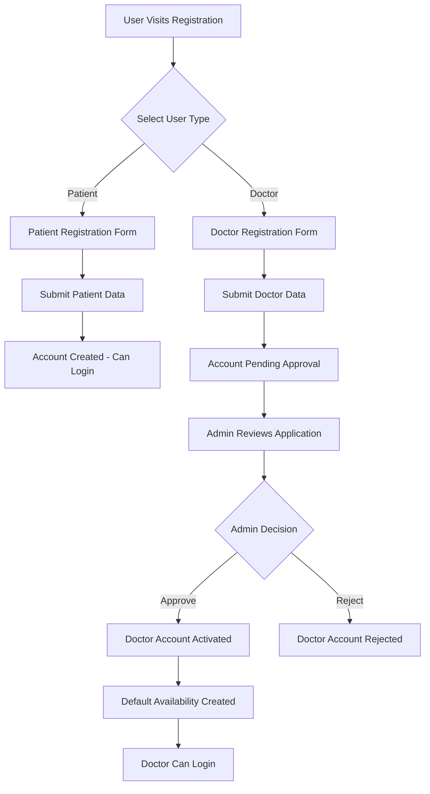
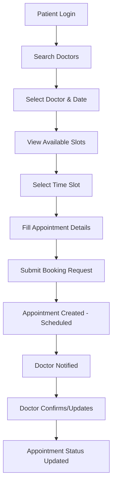
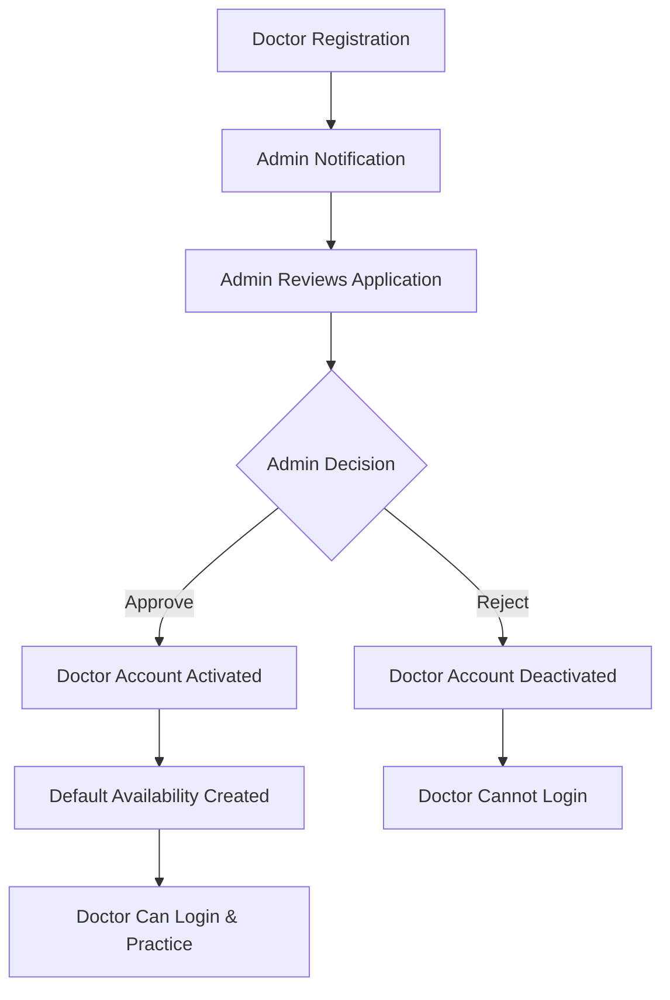

# Doctor Appointment System - Complete Documentation

## Table of Contents
1. [System Overview](#system-overview)
2. [Architecture](#architecture)
3. [Authentication & JWT Tokens](#authentication--jwt-tokens)
4. [User Roles & Permissions](#user-roles--permissions)
5. [Application Flow](#application-flow)
6. [Backend API Documentation](#backend-api-documentation)
7. [Database Schema](#database-schema)
8. [Frontend Components](#frontend-components)
9. [Deployment Guide](#deployment-guide)
10. [Testing Guide](#testing-guide)

---

## System Overview

The Doctor Appointment System is a comprehensive healthcare management platform built with ASP.NET Core Web API backend and React.js frontend. It enables patients to book appointments with doctors, allows doctors to manage their schedules, and provides administrators with system oversight capabilities.

### Key Features
- **Patient Registration & Management**
- **Doctor Registration with Admin Approval**
- **Appointment Booking & Management**
- **Availability Management**
- **Role-based Access Control**
- **Real-time Status Updates**
- **Report Generation (PDF/Excel)**
- **Responsive Web Interface**

---

## Architecture

### Technology Stack

#### Backend
- **Framework**: ASP.NET Core 9.0 Web API
- **Database**: Entity Framework Core with SQL Server
- **Authentication**: JWT (JSON Web Tokens)
- **Password Hashing**: BCrypt.Net
- **Logging**: Built-in ASP.NET Core Logging
- **CORS**: Cross-Origin Resource Sharing enabled

#### Frontend
- **Framework**: React.js 18
- **Build Tool**: Vite
- **Styling**: Tailwind CSS
- **State Management**: React Context API
- **HTTP Client**: Axios
- **Routing**: React Router DOM
- **UI Components**: Lucide React Icons
- **Notifications**: React Hot Toast

### System Architecture Diagram

```
┌─────────────────┐    HTTPS     ┌─────────────────┐
│   React.js      │◄────────────►│  ASP.NET Core   │
│   Frontend      │              │  Web API        │
│                 │              │                 │
│ • Patient Portal│              │ • Authentication│
│ • Doctor Portal │              │ • Business Logic│
│ • Admin Portal  │              │ • Data Access   │
└─────────────────┘              └─────────────────┘
                                         │
                                         │ Entity Framework
                                         ▼
                                 ┌─────────────────┐
                                 │   SQL Server    │
                                 │   Database      │
                                 │                 │
                                 │ • Users         │
                                 │ • Appointments  │
                                 │ • Availability  │
                                 └─────────────────┘
```

---

## Authentication & JWT Tokens

### JWT Token Structure

The system uses JWT tokens for stateless authentication. Each token contains:

```json
{
  "header": {
    "alg": "HS256",
    "typ": "JWT"
  },
  "payload": {
    "sub": "user_id",
    "email": "user@example.com",
    "role": "Patient|Doctor|Admin",
    "iat": 1640995200,
    "exp": 1641081600
  }
}
```

### Token Configuration

```csharp
// JWT Configuration in appsettings.json
{
  "Jwt": {
    "Key": "YourSecretKeyHere_MustBeAtLeast32Characters",
    "Issuer": "DoctorAppointmentAPI",
    "Audience": "DoctorAppointmentClient",
    "ExpiryMinutes": 60
  }
}
```

### Authentication Flow

1. **User Login**
   ```
   POST /api/auth/login
   Body: { "email": "user@example.com", "password": "password" }
   Response: { "token": "jwt_token", "user": { ... } }
   ```

2. **Token Storage**
   - Frontend stores token in localStorage
   - Token included in Authorization header: `Bearer <token>`

3. **Token Validation**
   - Backend validates token on each protected request
   - Token expiry checked automatically
   - Role-based authorization enforced

4. **Token Refresh**
   - Current implementation: Re-login required on expiry
   - Future enhancement: Refresh token mechanism

### Security Features

- **Password Hashing**: BCrypt with salt rounds
- **HTTPS Only**: All API communication encrypted
- **CORS Configuration**: Restricted to frontend domain
- **Role-based Authorization**: Different access levels
- **Input Validation**: Model validation and sanitization

---

## User Roles & Permissions

### 1. Patient Role
**Permissions:**
- Register account
- Search and view doctors
- Book appointments
- View own appointments
- Cancel appointments (with restrictions)
- Update profile

**Restrictions:**
- Cannot access doctor or admin features
- Cannot cancel appointments within 24 hours
- Cannot view other patients' data

### 2. Doctor Role
**Permissions:**
- Register account (requires admin approval)
- Update profile and availability
- View own appointments
- Update appointment status and notes
- View patient information for appointments

**Restrictions:**
- Cannot access admin features
- Cannot view other doctors' appointments
- Cannot access patient management

### 3. Admin Role
**Permissions:**
- Approve/reject doctor registrations
- View all appointments
- Cancel scheduled appointments
- Generate reports
- Manage system settings
- View all users

**Restrictions:**
- Cannot book appointments as patient
- Cannot access doctor-specific features

---

## Application Flow

### 1. User Registration Flow



### 2. Appointment Booking Flow



### 3. Doctor Approval Flow



---

## Backend API Documentation

### Base URL
```
https://localhost:7001/api
```

### Authentication Endpoints

#### POST /auth/login
**Description**: Authenticate user and return JWT token

**Request Body**:
```json
{
  "email": "user@example.com",
  "password": "password123"
}
```

**Response**:
```json
{
  "token": "eyJhbGciOiJIUzI1NiIsInR5cCI6IkpXVCJ9...",
  "user": {
    "id": 1,
    "email": "user@example.com",
    "firstName": "John",
    "lastName": "Doe",
    "role": "Patient",
    "isActive": true
  }
}
```

**Error Responses**:
- `400 Bad Request`: Invalid credentials
- `401 Unauthorized`: Account not verified (for doctors)
- `500 Internal Server Error`: Server error

#### POST /auth/register
**Description**: Register new user account

**Request Body**:
```json
{
  "email": "user@example.com",
  "password": "password123",
  "firstName": "John",
  "lastName": "Doe",
  "phoneNumber": "1234567890",
  "role": "Patient"
}
```

**Response**:
```json
{
  "message": "Registration successful",
  "userId": 1
}
```

### Doctor Endpoints

#### GET /doctors
**Description**: Get list of doctors with optional search parameters

**Query Parameters**:
- `specialization` (optional): Filter by specialization
- `search` (optional): Search by name

**Response**:
```json
[
  {
    "id": 1,
    "firstName": "Dr. Jane",
    "lastName": "Smith",
    "specialization": "Cardiology",
    "experience": 10,
    "consultationFee": 1000,
    "bio": "Experienced cardiologist...",
    "practiceAddress": "123 Medical St",
    "isVerified": true
  }
]
```

#### GET /doctors/profile
**Description**: Get current doctor's profile (requires Doctor role)

**Response**:
```json
{
  "id": 1,
  "firstName": "Dr. Jane",
  "lastName": "Smith",
  "specialization": "Cardiology",
  "experience": 10,
  "consultationFee": 1000,
  "bio": "Experienced cardiologist...",
  "practiceAddress": "123 Medical St",
  "isVerified": true,
  "userId": 1
}
```

#### PUT /doctors/profile
**Description**: Update doctor profile

**Request Body**:
```json
{
  "specialization": "Cardiology",
  "experience": 10,
  "consultationFee": 1000,
  "bio": "Updated bio...",
  "practiceAddress": "123 Medical St"
}
```

### Appointment Endpoints

#### GET /appointments
**Description**: Get appointments for current user

**Response**:
```json
[
  {
    "id": 1,
    "appointmentDate": "2024-01-15",
    "startTime": "10:00:00",
    "endTime": "11:00:00",
    "status": 1,
    "reason": "Regular checkup",
    "notes": "Patient doing well",
    "fee": 1000,
    "patientName": "John Doe",
    "doctorName": "Dr. Jane Smith",
    "doctorSpecialization": "Cardiology"
  }
]
```

#### POST /appointments
**Description**: Create new appointment

**Request Body**:
```json
{
  "doctorId": 1,
  "appointmentDate": "2024-01-15",
  "startTime": "10:00:00",
  "endTime": "11:00:00",
  "reason": "Regular checkup"
}
```

#### PATCH /appointments/{id}/status
**Description**: Update appointment status

**Request Body**:
```json
{
  "status": 1,
  "cancellationReason": "Patient requested"
}
```

**Status Values**:
- 0: Scheduled
- 1: Confirmed
- 2: InProgress
- 3: Completed
- 4: Cancelled
- 5: NoShow

### Availability Endpoints

#### GET /availability/my-availability
**Description**: Get current doctor's availability

**Response**:
```json
[
  {
    "id": 1,
    "dayOfWeek": 1,
    "startTime": "09:00:00",
    "endTime": "10:00:00",
    "isActive": true
  }
]
```

#### POST /availability/my-availability
**Description**: Create new availability slot

**Request Body**:
```json
{
  "dayOfWeek": 1,
  "startTime": "09:00:00",
  "endTime": "10:00:00"
}
```

#### GET /availability/doctor/{doctorId}/slots
**Description**: Get available time slots for a doctor

**Query Parameters**:
- `startDate`: Start date for availability check
- `endDate`: End date for availability check

### Admin Endpoints

#### GET /admin/dashboard-stats
**Description**: Get dashboard statistics (Admin only)

**Response**:
```json
{
  "totalUsers": 100,
  "totalDoctors": 25,
  "totalPatients": 75,
  "totalAppointments": 500,
  "pendingAppointments": 50,
  "completedAppointments": 400,
  "cancelledAppointments": 50
}
```

#### GET /admin/doctors/pending
**Description**: Get pending doctor approvals

**Response**:
```json
[
  {
    "id": 1,
    "firstName": "Dr. New",
    "lastName": "Doctor",
    "specialization": "General",
    "isVerified": false,
    "createdAt": "2024-01-01T00:00:00Z"
  }
]
```

#### POST /admin/doctors/{id}/approve
**Description**: Approve doctor registration

**Response**:
```json
{
  "message": "Doctor approved successfully"
}
```

#### POST /admin/doctors/{id}/reject
**Description**: Reject doctor registration

**Request Body**:
```json
{
  "reason": "Incomplete documentation"
}
```

---

## Database Schema

### Users Table
```sql
CREATE TABLE Users (
    Id INT PRIMARY KEY IDENTITY(1,1),
    Email NVARCHAR(255) UNIQUE NOT NULL,
    PasswordHash NVARCHAR(255) NOT NULL,
    FirstName NVARCHAR(100) NOT NULL,
    LastName NVARCHAR(100) NOT NULL,
    PhoneNumber NVARCHAR(20),
    Role NVARCHAR(20) NOT NULL, -- Patient, Doctor, Admin
    IsActive BIT DEFAULT 1,
    CreatedAt DATETIME2 DEFAULT GETUTCDATE(),
    UpdatedAt DATETIME2 DEFAULT GETUTCDATE()
);
```

### Doctors Table
```sql
CREATE TABLE Doctors (
    Id INT PRIMARY KEY IDENTITY(1,1),
    UserId INT FOREIGN KEY REFERENCES Users(Id),
    Specialization NVARCHAR(100),
    LicenseNumber NVARCHAR(100),
    Experience INT,
    ConsultationFee DECIMAL(10,2),
    Bio NVARCHAR(MAX),
    PracticeAddress NVARCHAR(500),
    IsVerified BIT DEFAULT 0,
    CreatedAt DATETIME2 DEFAULT GETUTCDATE(),
    UpdatedAt DATETIME2 DEFAULT GETUTCDATE()
);
```

### Patients Table
```sql
CREATE TABLE Patients (
    Id INT PRIMARY KEY IDENTITY(1,1),
    UserId INT FOREIGN KEY REFERENCES Users(Id),
    DateOfBirth DATE,
    Gender NVARCHAR(10),
    Address NVARCHAR(500),
    EmergencyContact NVARCHAR(20),
    MedicalHistory NVARCHAR(MAX),
    CreatedAt DATETIME2 DEFAULT GETUTCDATE(),
    UpdatedAt DATETIME2 DEFAULT GETUTCDATE()
);
```

### Appointments Table
```sql
CREATE TABLE Appointments (
    Id INT PRIMARY KEY IDENTITY(1,1),
    PatientId INT FOREIGN KEY REFERENCES Patients(Id),
    DoctorId INT FOREIGN KEY REFERENCES Doctors(Id),
    AppointmentDate DATE NOT NULL,
    StartTime TIME NOT NULL,
    EndTime TIME NOT NULL,
    Status INT NOT NULL, -- 0:Scheduled, 1:Confirmed, 2:InProgress, 3:Completed, 4:Cancelled, 5:NoShow
    Reason NVARCHAR(500),
    Notes NVARCHAR(MAX),
    Fee DECIMAL(10,2),
    CancellationReason NVARCHAR(500),
    CreatedAt DATETIME2 DEFAULT GETUTCDATE(),
    UpdatedAt DATETIME2 DEFAULT GETUTCDATE(),
    CancelledAt DATETIME2
);
```

### Availability Table
```sql
CREATE TABLE Availabilities (
    Id INT PRIMARY KEY IDENTITY(1,1),
    DoctorId INT FOREIGN KEY REFERENCES Doctors(Id),
    DayOfWeek INT NOT NULL, -- 0:Sunday, 1:Monday, ..., 6:Saturday
    StartTime TIME NOT NULL,
    EndTime TIME NOT NULL,
    IsActive BIT DEFAULT 1,
    CreatedAt DATETIME2 DEFAULT GETUTCDATE()
);
```

---

## Frontend Components

### Component Structure

```
src/
├── components/
│   ├── Navbar.jsx          # Main navigation
│   ├── Footer.jsx          # Footer component
│   └── ProtectedRoute.jsx  # Route protection
├── contexts/
│   └── AuthContext.jsx     # Authentication context
├── pages/
│   ├── HomePage.jsx        # Landing page
│   ├── LoginPage.jsx       # User login
│   ├── RegisterPage.jsx    # Patient registration
│   ├── DoctorRegisterPage.jsx # Doctor registration
│   ├── patient/
│   │   ├── PatientDashboard.jsx
│   │   ├── PatientProfile.jsx
│   │   ├── PatientAppointments.jsx
│   │   ├── BookAppointment.jsx
│   │   └── SearchDoctors.jsx
│   ├── doctor/
│   │   ├── DoctorDashboard.jsx
│   │   ├── DoctorProfile.jsx
│   │   ├── DoctorAppointments.jsx
│   │   └── DoctorAvailability.jsx
│   └── admin/
│       ├── AdminDashboard.jsx
│       ├── AdminAppointments.jsx
│       ├── AdminDoctors.jsx
│       ├── AdminPatients.jsx
│       ├── AdminPendingDoctors.jsx
│       └── AdminReports.jsx
├── services/
│   ├── api.js              # Axios configuration
│   ├── authService.js      # Authentication API calls
│   ├── patientService.js   # Patient API calls
│   ├── doctorService.js    # Doctor API calls
│   ├── appointmentService.js # Appointment API calls
│   ├── availabilityService.js # Availability API calls
│   └── adminService.js     # Admin API calls
└── utils/
    └── (utility functions)
```

### Key Frontend Features

#### Authentication Context
```javascript
const AuthContext = createContext();

export const useAuth = () => {
  const context = useContext(AuthContext);
  if (!context) {
    throw new Error('useAuth must be used within AuthProvider');
  }
  return context;
};
```

#### Protected Routes
```javascript
const ProtectedRoute = ({ children, allowedRoles }) => {
  const { user, loading } = useAuth();
  
  if (loading) return <LoadingSpinner />;
  if (!user) return <Navigate to="/login" />;
  if (!allowedRoles.includes(user.role)) return <UnauthorizedPage />;
  
  return children;
};
```

#### API Service Configuration
```javascript
const api = axios.create({
  baseURL: 'https://localhost:7001/api',
  headers: {
    'Content-Type': 'application/json',
  },
});

// Request interceptor to add auth token
api.interceptors.request.use((config) => {
  const token = localStorage.getItem('token');
  if (token) {
    config.headers.Authorization = `Bearer ${token}`;
  }
  return config;
});
```

---

## Deployment Guide

### Backend Deployment

#### Prerequisites
- .NET 9.0 SDK
- SQL Server (or SQL Server Express)
- IIS or Kestrel server

#### Steps
1. **Build the application**:
   ```bash
   dotnet build --configuration Release
   ```

2. **Update connection string** in `appsettings.Production.json`:
   ```json
   {
     "ConnectionStrings": {
       "DefaultConnection": "Server=your-server;Database=DoctorAppointmentDB;Trusted_Connection=true;TrustServerCertificate=true;"
     }
   }
   ```

3. **Run database migrations**:
   ```bash
   dotnet ef database update
   ```

4. **Deploy to IIS**:
   - Publish the application
   - Configure IIS application pool
   - Set up SSL certificate

### Frontend Deployment

#### Prerequisites
- Node.js 18+
- npm or yarn

#### Steps
1. **Install dependencies**:
   ```bash
   npm install
   ```

2. **Build for production**:
   ```bash
   npm run build
   ```

3. **Deploy to web server**:
   - Copy `dist` folder contents to web server
   - Configure web server (Apache, Nginx, IIS)
   - Set up SSL certificate

### Environment Configuration

#### Backend Environment Variables
```bash
ASPNETCORE_ENVIRONMENT=Production
ASPNETCORE_URLS=https://localhost:7001
ConnectionStrings__DefaultConnection=your-connection-string
Jwt__Key=your-secret-key
Jwt__Issuer=DoctorAppointmentAPI
Jwt__Audience=DoctorAppointmentClient
```

#### Frontend Environment Variables
```bash
VITE_API_BASE_URL=https://your-api-domain.com/api
```

---

## Testing Guide

### Backend Testing

#### Unit Tests
```bash
dotnet test
```

#### API Testing with Postman
1. Import the provided Postman collection
2. Set up environment variables
3. Run the authentication flow first
4. Test individual endpoints

#### Database Testing
```sql
-- Test user creation
INSERT INTO Users (Email, PasswordHash, FirstName, LastName, Role) 
VALUES ('test@example.com', 'hashed_password', 'Test', 'User', 'Patient');

-- Test appointment creation
INSERT INTO Appointments (PatientId, DoctorId, AppointmentDate, StartTime, EndTime, Status)
VALUES (1, 1, '2024-01-15', '10:00:00', '11:00:00', 0);
```

### Frontend Testing

#### Component Testing
```bash
npm run test
```

#### E2E Testing
```bash
npm run test:e2e
```

#### Manual Testing Checklist

**Authentication Flow**:
- [ ] User can register as patient
- [ ] User can register as doctor
- [ ] Doctor registration requires admin approval
- [ ] Login works with valid credentials
- [ ] Login fails with invalid credentials
- [ ] JWT token is stored and used correctly

**Patient Features**:
- [ ] Can search and view doctors
- [ ] Can book appointments
- [ ] Can view own appointments
- [ ] Can cancel appointments (with restrictions)
- [ ] Cannot access doctor/admin features

**Doctor Features**:
- [ ] Can update profile
- [ ] Can manage availability
- [ ] Can view own appointments
- [ ] Can update appointment status
- [ ] Cannot access admin features

**Admin Features**:
- [ ] Can approve/reject doctors
- [ ] Can view all appointments
- [ ] Can cancel scheduled appointments
- [ ] Can generate reports
- [ ] Cannot book appointments

---

## Security Considerations

### Authentication Security
- JWT tokens have expiration time
- Passwords are hashed with BCrypt
- HTTPS enforced for all communications
- CORS properly configured

### Authorization Security
- Role-based access control implemented
- Protected routes on frontend
- Authorize attributes on backend endpoints
- Input validation and sanitization

### Data Security
- SQL injection prevention with Entity Framework
- XSS protection with input validation
- CSRF protection with same-origin policy
- Sensitive data not logged

---

## Troubleshooting

### Common Issues

#### Backend Issues
1. **Database Connection Failed**
   - Check connection string
   - Verify SQL Server is running
   - Check firewall settings

2. **JWT Token Invalid**
   - Verify JWT configuration
   - Check token expiration
   - Ensure proper token format

3. **CORS Errors**
   - Update CORS policy in Program.cs
   - Check frontend URL configuration

#### Frontend Issues
1. **API Calls Failing**
   - Check API base URL
   - Verify authentication token
   - Check network connectivity

2. **Routing Issues**
   - Verify React Router configuration
   - Check protected route setup
   - Ensure proper navigation

3. **State Management Issues**
   - Check AuthContext implementation
   - Verify token storage/retrieval
   - Check component re-rendering

### Log Files
- Backend logs: Check application logs in configured location
- Frontend logs: Check browser console for errors
- Database logs: Check SQL Server logs for connection issues

---

## Future Enhancements

### Planned Features
1. **Real-time Notifications**
   - SignalR integration
   - Email notifications
   - SMS notifications

2. **Advanced Reporting**
   - Custom report builder
   - Scheduled reports
   - Data visualization

3. **Mobile Application**
   - React Native app
   - Push notifications
   - Offline capabilities

4. **Payment Integration**
   - Online payment gateway
   - Insurance integration
   - Billing management

5. **Telemedicine Features**
   - Video consultations
   - File sharing
   - Prescription management

### Technical Improvements
1. **Performance Optimization**
   - Database indexing
   - Caching implementation
   - API response optimization

2. **Security Enhancements**
   - Two-factor authentication
   - Audit logging
   - Data encryption

3. **Scalability**
   - Microservices architecture
   - Load balancing
   - Database sharding

---

## Support and Maintenance

### Regular Maintenance Tasks
1. **Database Maintenance**
   - Regular backups
   - Index optimization
   - Data cleanup

2. **Security Updates**
   - Framework updates
   - Dependency updates
   - Security patches

3. **Performance Monitoring**
   - Application performance monitoring
   - Database performance monitoring
   - User experience monitoring

### Contact Information
- **Technical Support**: [Your support email]
- **Documentation**: [Your documentation URL]
- **Issue Tracking**: [Your issue tracking system]

---

*This documentation is maintained and updated regularly. For the latest version, please refer to the project repository.*

