# Doctor Appointment System - Flow Diagrams

## Table of Contents
1. [System Architecture Flow](#system-architecture-flow)
2. [Authentication Flow](#authentication-flow)
3. [User Registration Flow](#user-registration-flow)
4. [Appointment Booking Flow](#appointment-booking-flow)
5. [Doctor Approval Flow](#doctor-approval-flow)
6. [Availability Management Flow](#availability-management-flow)
7. [Status Update Flow](#status-update-flow)
8. [Report Generation Flow](#report-generation-flow)

---

## System Architecture Flow

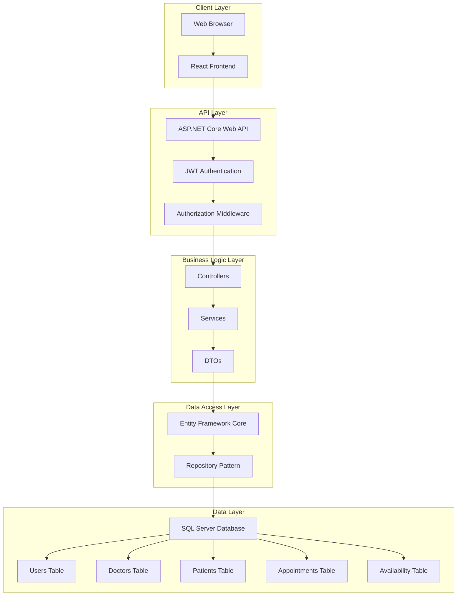

---

## Authentication Flow

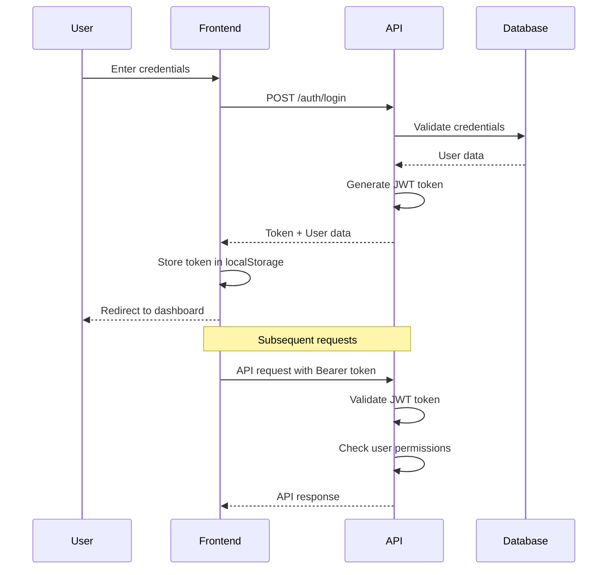

---

## User Registration Flow

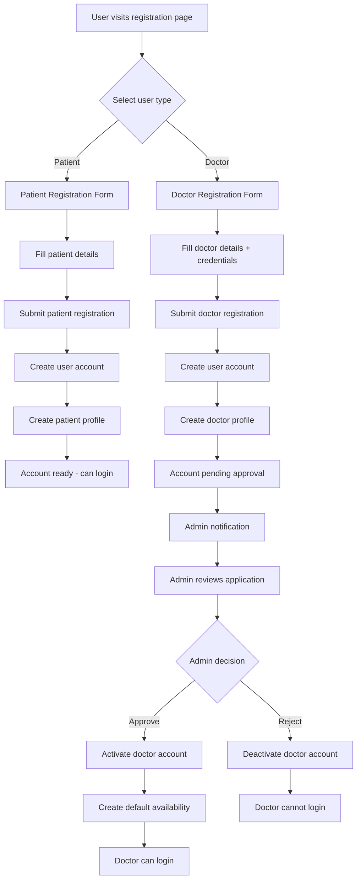

---

## Appointment Booking Flow

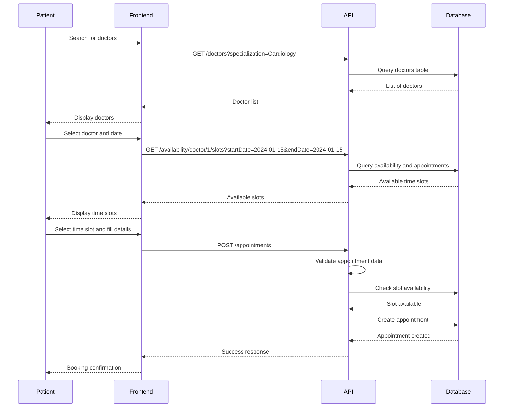

---

## Doctor Approval Flow

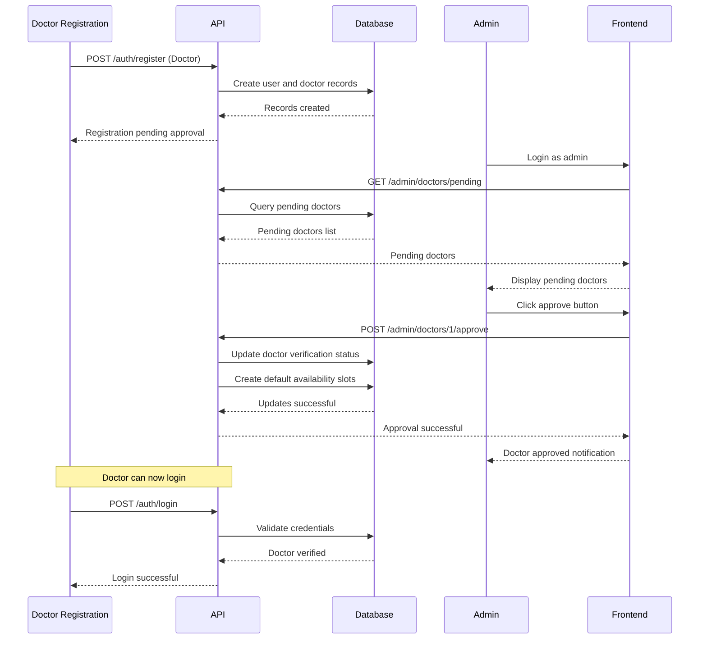

---

## Availability Management Flow

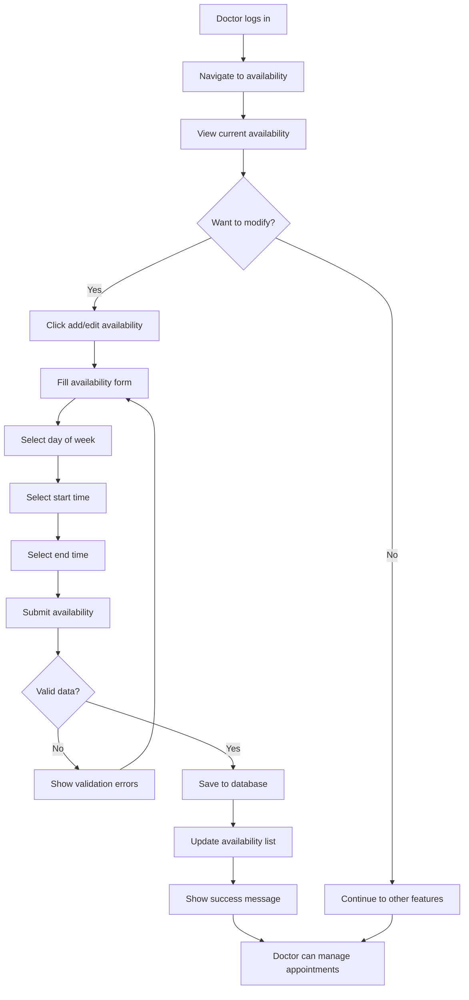

---

## Status Update Flow

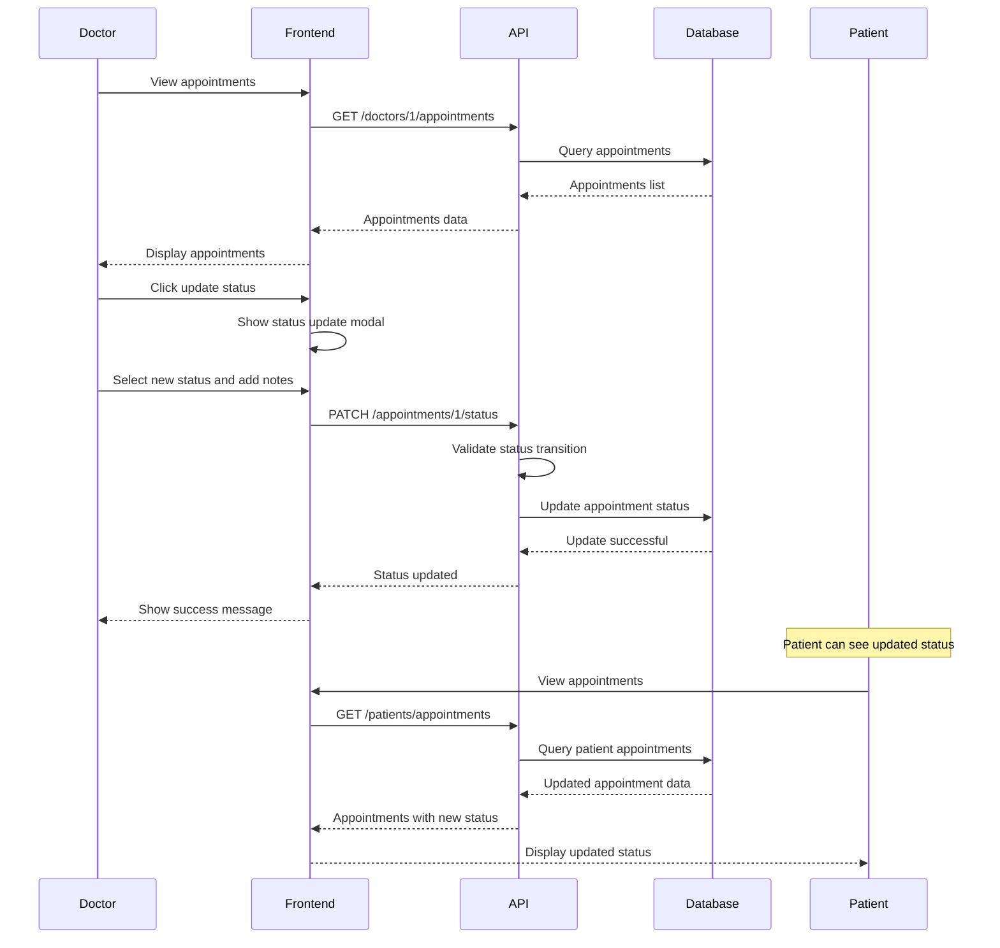

---

## Report Generation Flow

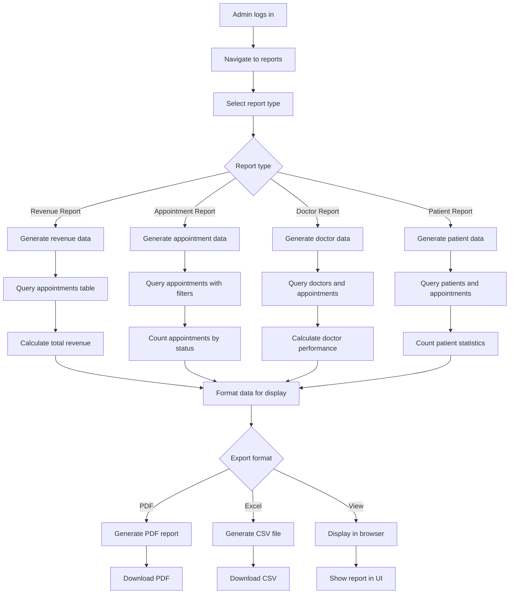

---

## Data Flow Diagrams

### Patient Data Flow

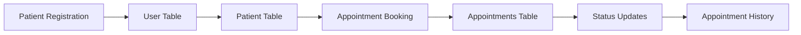

### Doctor Data Flow

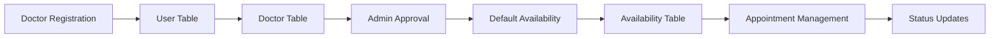

### Admin Data Flow

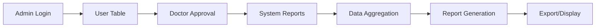

---

## Error Handling Flow

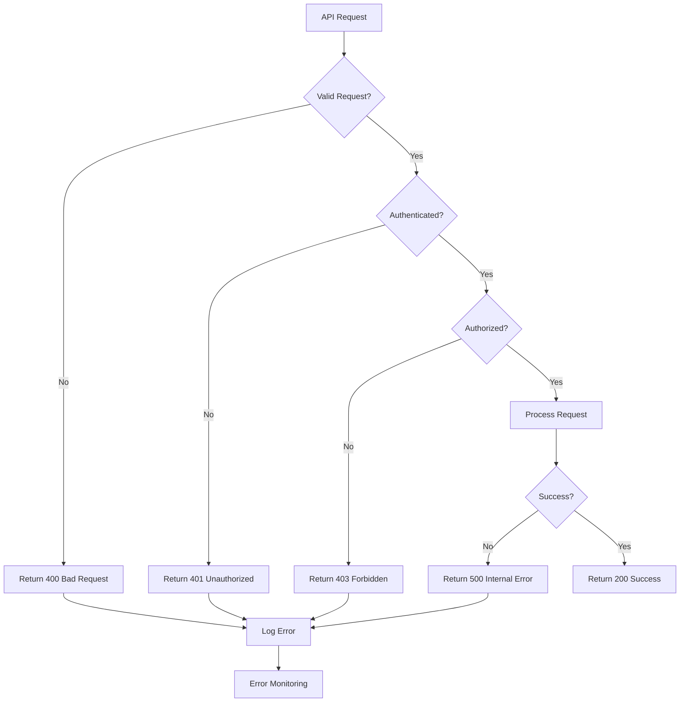

---

## Security Flow

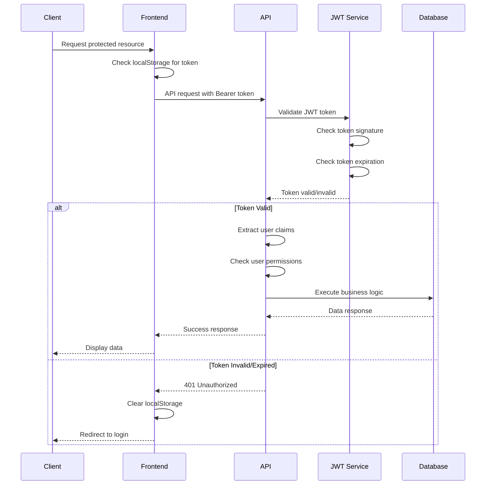

---

## Database Transaction Flow

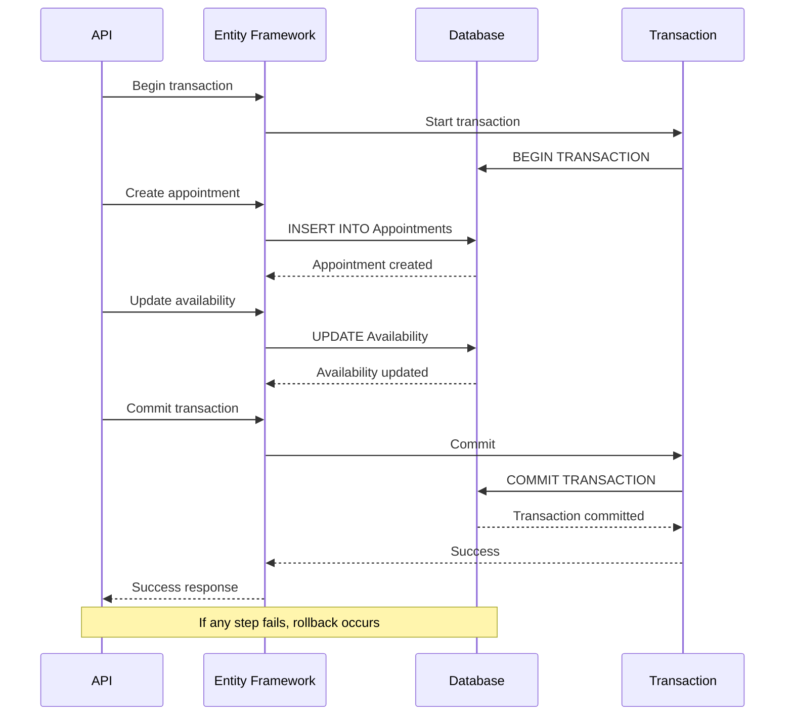

---

## Caching Flow (Future Enhancement)

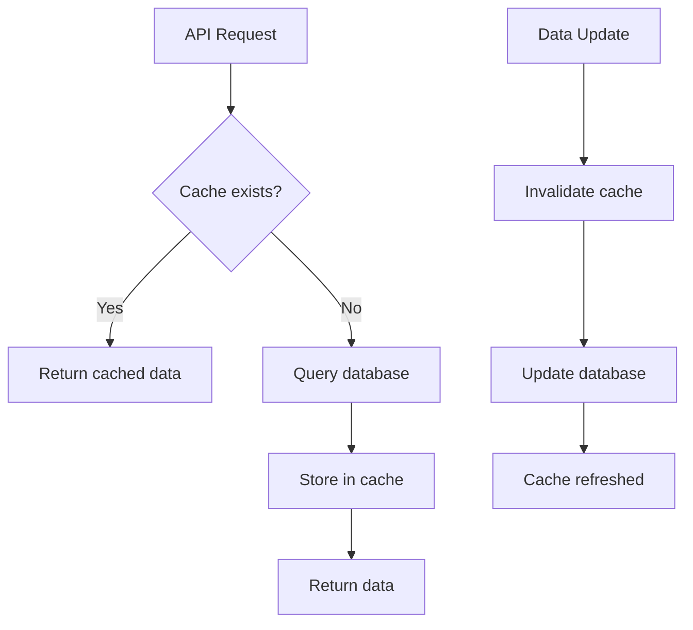

---

## Notification Flow (Future Enhancement)

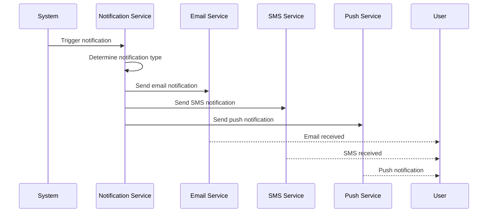

---

*These flow diagrams provide a comprehensive view of how the Doctor Appointment System operates. They can be used for system understanding, development planning, and troubleshooting.*

